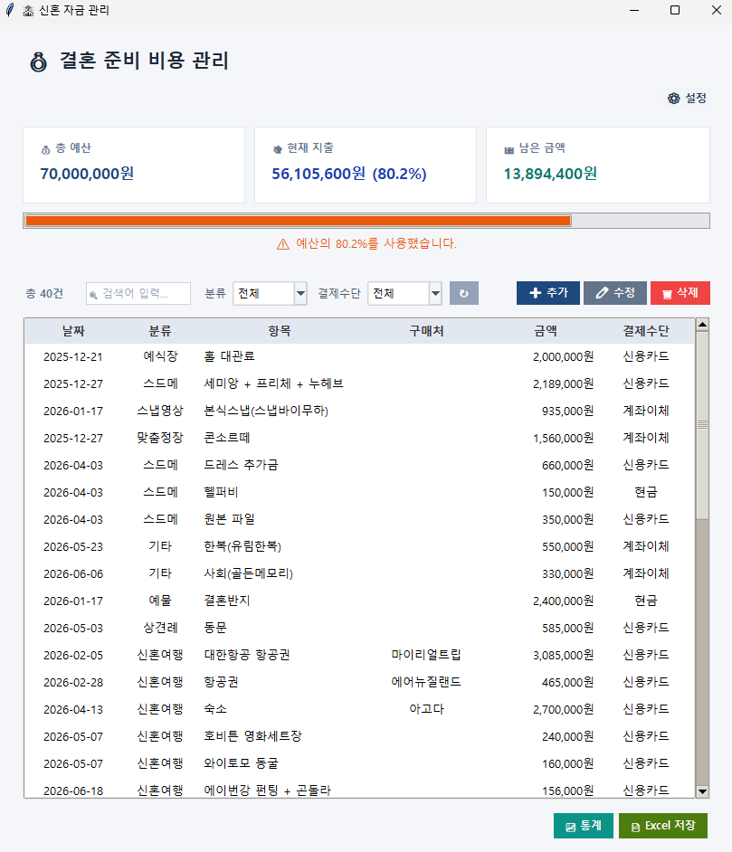
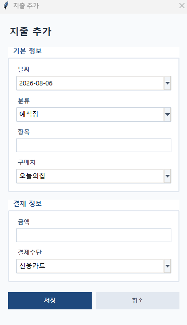
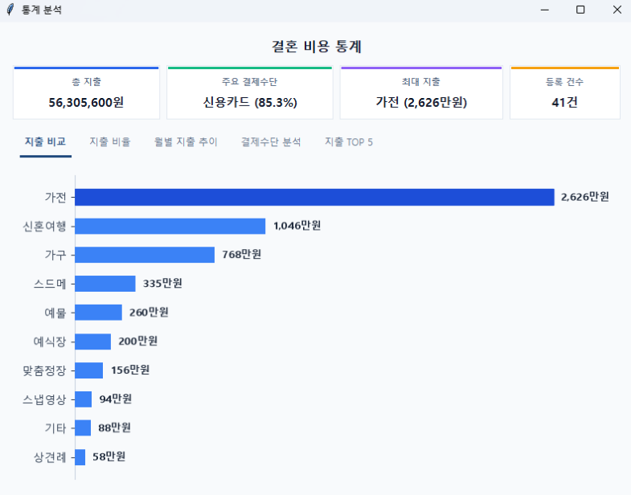
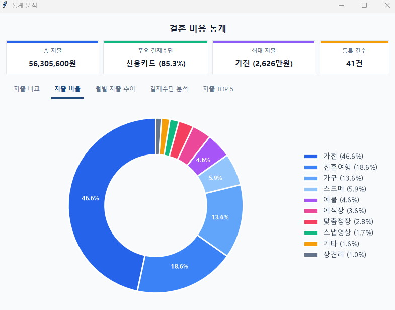
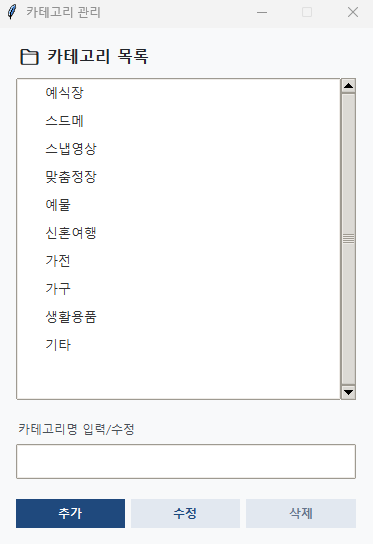
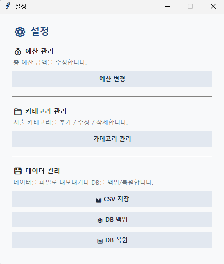
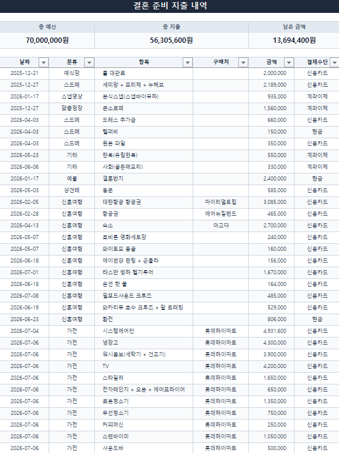
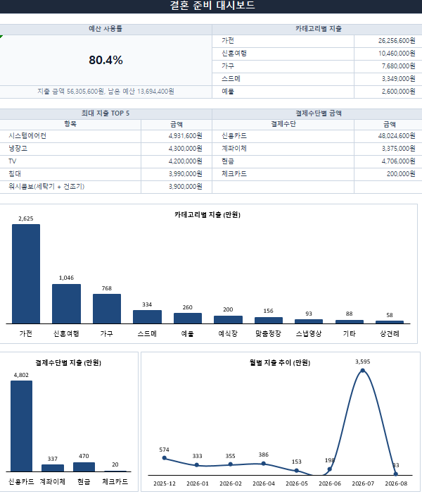

# 💍 WeddingMoneyManager

> **Python Tkinter와 SQLite를 기반으로 개발한 신혼 자금 관리 데스크톱 애플리케이션입니다. 예산 관리, 지출 관리, 카테고리 관리, 통계 분석, Excel Report, 데이터 백업 및 복원 기능을 제공합니다.**

## 📦 Download

Windows 환경에서는 PyInstaller로 빌드된 실행 파일(`WeddingMoneyManager.exe`)을 통해 사용할 수 있습니다.

> Release 페이지에서 최신 Windows 실행 파일을 다운로드할 수 있습니다.

---

결혼 준비 과정에서 발생하는 **예식, 혼수, 가전·가구, 생활용품, 신혼여행** 등의 다양한 지출을 체계적으로 관리하기 위해 개발한 개인 프로젝트입니다.

예산 설정부터 지출 내역 관리, 검색 및 필터링, 카테고리 관리, Dashboard를 통한 예산 현황 확인, 통계 분석, Excel Report 생성, 데이터 백업 및 복원까지 실제 사용을 고려하여 구현했습니다.


---

# 📌 프로젝트 소개

결혼 준비는 짧은 기간 동안 많은 비용이 발생하기 때문에 체계적인 관리가 필요합니다.

WeddingMoneyManager는 이러한 비용을 직접 관리하기 위해 개발한 프로그램으로, 단순한 가계부를 넘어 **예산 관리와 지출 분석 기능을 제공하는 데스크톱 애플리케이션**입니다.

프로젝트 초기에는 JSON 파일을 이용하여 데이터를 저장했지만, 기능이 확장되면서 SQLite Database를 도입하고 데이터 접근 로직을 별도 패키지로 분리했습니다.

또한 UI, Database, Utility, Excel 기능을 각각 분리하여 유지보수성과 확장성을 개선했습니다.

이 프로젝트를 통해 다음과 같은 기술을 학습하고 실제 애플리케이션에 적용했습니다.

* Python GUI 프로그래밍
* Tkinter / ttk
* SQLite Database 및 CRUD
* 데이터 접근 계층 분리
* 객체 지향 설계
* 이벤트 처리
* Matplotlib 데이터 시각화
* openpyxl Excel 자동화
* 데이터 백업 및 복원
* PyInstaller Windows 실행 파일 배포
* Git / GitHub 버전 관리

---

# ✨ 주요 기능

## 💰 비용 관리

* [x] 총 예산 설정
* [x] 설정 창을 통한 예산 변경
* [x] 지출 내역 등록
* [x] 지출 내역 수정
* [x] 지출 내역 삭제
* [x] SQLite 데이터베이스 기반 데이터 관리

---

## 📋 지출 목록 관리

* [x] Treeview 기반 목록 출력
* [x] 날짜 / 카테고리 / 항목 / 구매처 / 금액 / 결제수단 표시
* [x] 컬럼 클릭 정렬
* [x] 오름차순 / 내림차순 정렬
* [x] 고유 ID 기반 데이터 관리
* [x] 수정 후 선택 행 유지
* [x] 추가 후 등록한 행 자동 선택

---

## 🔍 검색 및 필터

* [x] 항목명 검색
* [x] 구매처 검색
* [x] 카테고리 필터
* [x] 결제수단 필터
* [x] 검색 조건 초기화

---

## 📊 Dashboard

* [x] 총 예산 Card 표시
* [x] 현재 지출 Card 표시
* [x] 남은 금액 Card 표시
* [x] 예산 사용률 ProgressBar
* [x] 예산 사용률 상태 표시
* [x] 최근 지출 TOP 5 표시
* [x] 카테고리별 지출 분석
* [x] 결제수단별 지출 분석
* [x] Matplotlib 기반 데이터 시각화

---

## 🗂 카테고리 관리

카테고리를 데이터베이스에서 직접 관리할 수 있도록 기능을 추가했습니다.

* [x] 카테고리 추가
* [x] 카테고리 수정
* [x] 카테고리 삭제
* [x] SQLite 기반 카테고리 관리
* [x] 중복 카테고리 추가 방지
* [x] 사용 중인 카테고리 삭제 방지
* [x] 지출 등록 / 수정 화면과 카테고리 데이터 연동

---

## ⚙ 설정 및 데이터 관리

설정 창을 통해 프로그램의 주요 관리 기능을 한 곳에서 사용할 수 있도록 구성했습니다.

* [x] 예산 설정
* [x] 카테고리 관리
* [x] CSV 데이터 내보내기
* [x] Database 백업
* [x] Database 복원
* [x] Database 복원 전 파일 유효성 검증
* [x] Database 복원 전 현재 DB 자동 백업
* [x] 복원 완료 후 프로그램 재실행 안내
* [x] 설정 창 Modal 처리로 메인 화면과의 동시 조작 방지

### Database 복원 검증

잘못된 `.db` 파일이나 WeddingMoneyManager에서 사용할 수 없는 SQLite Database를 선택했을 경우 복원을 진행하지 않도록 검증 기능을 추가했습니다.

이를 통해 사용자의 기존 Database가 잘못된 파일로 덮어써지는 문제를 방지합니다.

---

## 📈 Excel Report

* [x] Excel 리포트 자동 생성
* [x] Summary 대시보드 시트 생성
* [x] Detail 지출 내역 시트 생성
* [x] 예산 사용률 카드 표시
* [x] 카테고리별 지출 분석
* [x] 결제수단별 지출 분석
* [x] 최근 지출 TOP 5 표시
* [x] 카테고리별 BarChart 생성
* [x] 월별 지출 LineChart 생성

---

# 🛠 기술 스택

| 구분              | 기술                 |
| --------------- | ------------------ |
| Language        | Python 3           |
| GUI             | Tkinter, ttk       |
| Database        | SQLite / sqlite3   |
| Excel           | openpyxl           |
| Visualization   | Matplotlib         |
| Calendar        | tkcalendar         |
| Development     | Visual Studio Code |
| Version Control | Git / GitHub       |
| Build           | PyInstaller        |
| Chart           | openpyxl.chart, Matplotlib |

---

# 🏗 프로젝트 구조

기능이 확장되면서 하나의 파일에 집중되어 있던 코드를 역할별 패키지로 분리했습니다.

```text
WeddingMoneyManager
│
├── main.py
│
├── database/
│   ├── __init__.py
│   ├── connection.py
│   ├── init_db.py
│   ├── expense.py
│   ├── settings.py
│   └── category.py
│
├── ui/
│   ├── __init__.py
│   ├── expense_dialog.py
│   ├── statistics_window.py
│   ├── category_window.py
│   ├── settings_window.py
│   └── budget_dialog.py
│
├── utils/
│   ├── __init__.py
│   ├── csv_export.py
│   └── database_backup.py
│
├── excel/
│   ├── __init__.py
│   ├── excel_export.py
│   ├── chart.py
│   ├── detail.py
│   ├── summary.py
│   └── style.py
│
├── resources/
│   └── wedding.db
│       └── 배포용 초기 템플릿 DB
│
├── images/
│   └── README 이미지
│
├── archive/
│   ├── app.py
│   ├── database_legacy.py
│   ├── main_json.py
│   └── money_backup.json
│
├── migrate_json_to_sqlite.py
├── WeddingMoneyManager.spec
├── icon.ico
├── README.md
└── study.md
```

### 패키지별 역할

| 패키지          | 역할                                            |
| ------------ | --------------------------------------------- |
| `database/`  | SQLite 연결 및 데이터 CRUD 관리                       |
| `ui/`        | Tkinter 화면 및 사용자 인터페이스 관리                     |
| `utils/`     | CSV Export, Database Backup / Restore 등 공통 기능 |
| `excel/`     | Excel Report 및 차트 생성                          |
| `resources/` | 배포용 초기 Database                               |
| `archive/`   | 개발 과정에서 사용한 이전 버전 및 백업 파일                     |

기존 `backup` 폴더는 프로젝트 구조를 명확하게 하기 위해 `archive` 폴더로 변경했습니다.

---

# 🧩 프로젝트 구조 개선

초기에는 메인 파일에서 화면 처리와 데이터 처리를 함께 관리했지만, 프로젝트가 확장되면서 기능별로 역할을 분리했습니다.

### 기존 구조

```text
main.py
│
├── GUI
├── 데이터 처리
├── JSON 저장
├── 검색
├── 통계
└── Excel 처리
```

### 현재 구조

```text
main.py
│
├── database/
│   └── SQLite 데이터 관리
│
├── ui/
│   └── Tkinter 화면 관리
│
├── utils/
│   └── 공통 기능 및 데이터 관리
│
└── excel/
    └── Excel Report 생성
```

이를 통해 각 기능의 책임을 분리하고 코드의 유지보수성과 확장성을 개선했습니다.

---

# 💾 Database Schema

## expenses

지출 내역을 저장하는 테이블입니다.

| Column   | Type    | Description |
| -------- | ------- | ----------- |
| id       | INTEGER | 지출 ID (PK)  |
| date     | TEXT    | 지출 날짜       |
| category | TEXT    | 카테고리        |
| item     | TEXT    | 항목          |
| shop     | TEXT    | 구매처         |
| price    | INTEGER | 금액          |
| payment  | TEXT    | 결제수단        |

```sql
CREATE TABLE expenses (
    id INTEGER PRIMARY KEY AUTOINCREMENT,
    date TEXT NOT NULL,
    category TEXT NOT NULL,
    item TEXT NOT NULL,
    shop TEXT,
    price INTEGER NOT NULL,
    payment TEXT
);
```

---

## settings

프로그램 설정값을 저장하는 테이블입니다.

| Column | Type | Description |
| ------ | ---- | ----------- |
| key    | TEXT | 설정 이름       |
| value  | TEXT | 설정 값        |

예:

```text
key      : budget
value    : 30000000
```

```sql
CREATE TABLE settings (
    key TEXT PRIMARY KEY,
    value TEXT
);
```

---

## categories

사용자가 관리하는 카테고리를 저장하는 테이블입니다.

| Column | Type    | Description  |
| ------ | ------- | ------------ |
| id     | INTEGER | 카테고리 ID (PK) |
| name   | TEXT    | 카테고리 이름      |

```sql
CREATE TABLE categories (
    id INTEGER PRIMARY KEY AUTOINCREMENT,
    name TEXT UNIQUE NOT NULL
);
```

---

# 📷 화면

## 메인 Dashboard

예산, 현재 지출, 남은 금액 및 예산 사용률을 한눈에 확인할 수 있습니다.



---

## 지출 등록 / 수정

날짜, 카테고리, 항목, 구매처, 금액, 결제수단을 입력하여 지출 내역을 관리할 수 있습니다.



---

## 통계 화면

카테고리별 및 결제수단별 지출 현황을 그래프로 확인할 수 있습니다.




---

## 카테고리 관리

카테고리를 추가, 수정, 삭제할 수 있으며 데이터베이스와 연동되어 지출 등록 화면에 반영됩니다.



---

## 설정

설정 창에서 예산 관리, 카테고리 관리, CSV Export, Database Backup / Restore 기능을 사용할 수 있습니다.



---

## Excel Report

Summary와 Detail Sheet를 포함한 Excel Report를 자동으로 생성합니다.




---

# ⚙ 실행 방법

## 1. 저장소 Clone

```bash
git clone https://github.com/byeon-ji-young/WeddingMoneyManager.git
```

## 2. 가상환경 생성

```bash
python -m venv .venv
```

## 3. 가상환경 활성화

### Windows PowerShell

```bash
.\.venv\Scripts\Activate.ps1
```

### Windows CMD

```bash
.\.venv\Scripts\activate.bat
```

## 4. 패키지 설치

```bash
cd WeddingMoneyManager

python -m pip install -r requirements.txt
```

## 5. 프로그램 실행

```bash
python main.py
```

---

# 🪟 Windows 실행 파일

Windows 환경에서는 PyInstaller로 빌드된 실행 파일을 사용할 수 있습니다.

```text
dist/
└── WeddingMoneyManager/
    ├── WeddingMoneyManager.exe
    └── _internal/
        └── wedding.db
```

`wedding.db`는 프로그램 실행에 필요한 초기 Database Template로 사용됩니다.

실행 후 생성 및 변경되는 사용자 데이터는 별도의 사용자 DB에서 관리하여 프로그램 업데이트 및 재배포 시 기존 데이터를 유지할 수 있도록 구성했습니다.

---

# 🔨 Build

Developer 환경에서는 PyInstaller spec 파일을 이용하여 실행 파일을 생성합니다.

```bash
pyinstaller WeddingMoneyManager.spec
```

필요한 경우 기존 Build 결과물을 정리한 후 다시 생성할 수 있습니다.

```bash
pyinstaller --clean WeddingMoneyManager.spec
```

### WeddingMoneyManager.spec

`.spec` 파일은 PyInstaller Build 설정을 관리합니다.

* 실행 파일 이름
* Application Icon
* Hidden Import
* Database 및 리소스 파일
* 추가 데이터 파일
* Build 설정

---

# 🗺 Roadmap

## Future Improvements

* [ ] Flutter 모바일 앱 개발
* [ ] 클라우드 데이터 동기화

---

# 📦 Version History

| Version    | Description                                                                                                                                               |
| ---------- | --------------------------------------------------------------------------------------------------------------------------------------------------------- |
| **v0.5.0** | 첫 번째 공식 Release / Dashboard UI 개선 / 검색·필터 기능 추가 / ExpenseDialog 분리 / 고유 ID 기반 데이터 관리                                                                      |
| **v0.6.0** | Excel Report 기능 추가 / openpyxl 기반 Summary·Detail 시트 생성 / 지출 분석 Dashboard / 차트 기능 구현                                                                        |
| **v0.7.0** | Dashboard UI 완성 / Card UI 적용 / 예산·지출·잔액 표시 / ExpenseDialog UI 개선 / 프로젝트 구조 정리                                                                             |
| **v0.8.0** | 통계창 완성 / 최근 지출 TOP 5 추가 / 버튼 및 레이아웃 개선 / 그래프 디자인 마무리                                                                                                      |
| **v0.9.0** | SQLite 데이터베이스 적용 / JSON → SQLite Migration / Database CRUD 구현 / Settings 테이블 추가                                                                           |
| **v1.0.0** | CSV Export / Database Backup & Restore / SQLite 데이터 관리 개선 / PyInstaller EXE 배포 환경 구축 / 초기 DB 리소스 관리 / 사용자 DB 분리                                           |
| **v1.1.0** | Category Management / Settings 기능 추가 / Budget 설정 Callback / CSV Export·Database Backup & Restore 기능 개선 / Restore DB 유효성 검증 / 프로젝트 패키지 구조 개선 / UI 개선 |

---

# 📚 Documentation

프로젝트 개발 과정과 학습 내용은 아래 문서에 정리되어 있습니다.

* **development_log.md** : 개발 과정 및 주요 변경 사항
* **study.md** : Python / Tkinter / SQLite / openpyxl / Matplotlib 학습 노트

---

# 👤 Developer

**Jiyoung Byeon**

WeddingMoneyManager는 결혼 준비 과정에서 발생하는 실제 지출 데이터를 관리하기 위해 개발한 개인 프로젝트입니다.

단순한 기능 구현을 넘어 Python GUI 프로그래밍(Tkinter), SQLite 데이터베이스 설계 및 CRUD 구현, 이벤트 처리, 객체 지향 설계, 모듈 분리, 데이터 시각화(Matplotlib), Excel 자동화(openpyxl), 데이터 백업 및 복원, Windows 실행 파일 배포(PyInstaller) 등 실제 애플리케이션 개발 과정에서 필요한 기술을 학습하고 적용했습니다.
